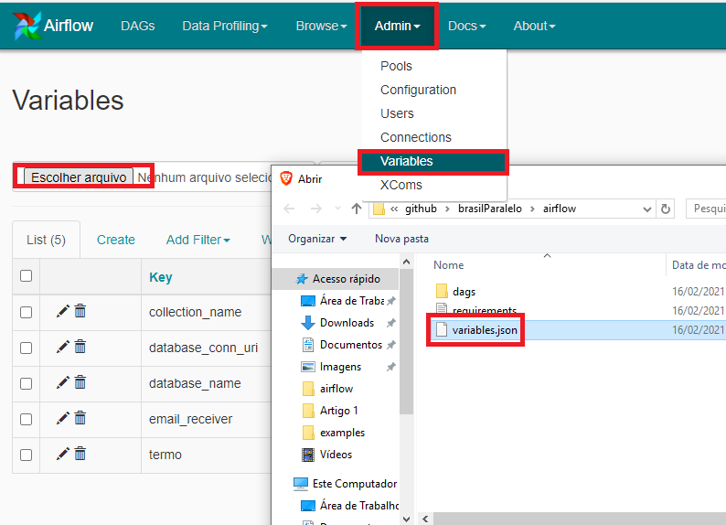

Atividade Brasil Paralelo
---

Este código foi gerado para atender aos requisitos enviados pelo Konrad na terça-feira, dia  9 de fevereiro, às 21:57, conforme texto destacado abaixo:

> O objetivo deste exercício é testar sua habilidade de criar um fluxo de processamento de dados demonstrando boas práticas na arquitetura de sua solução. Para tal, imagine que você está servindo a dois clientes: (1) uma equipe de cientistas de dados que quer trabalhar com todos os comentários feitos no Hacker News; (2) uma equipe de analistas que quer receber alertas toda vez que certos termos forem citados nos comentários. Gere um dataset para o primeiro cliente, e dispare um alarme para o segundo.

## Sobre a solução
Seguindo parte da orientação e na codificação de minha preferência, desenvolvi uma solução que lê os dados do hacker-news através da API oficial fornecida e recomendada por eles, grava os dados no mongoDB na estrutura em que os dados estão formatados na API e envia e-mail caso um termo pré-definido seja encontrado.<br>

### Detalhes técnicos da solução
#### Do fluxo
1. Processar os comentários e histórias a partir do último ID persistido no banco de dados. Caso não tenha ID algum no banco de dados, são lidas as [500 novas histórias](https://hacker-news.firebaseio.com/v0/newstories.json) pela API da hacker-news.
   - Para cada história, são lidos todos os descendentes, ainda que seja maior que a quantidade de filhos (comentário do comentário).
        ```yaml
        {
        "by" : "kmcquade",
        "descendants" : 18,
        "id" : 26154038,
        "kids" : [ 26154742, 26154244, 26154730, 26154505, 26154285, 26154677, 26154513, 26154443, 26154506 ],
        "score" : 77,
        "time" : 1613485014,
        "title" : "Show HN: Endgame – An AWS Pentesting tool to backdoor or expose AWS resources",
        "type" : "story",
        "url" : "https://github.com/salesforce/endgame"
        }
        ```
    - Para cada comentário, também são lidos todos os descendentes, ainda que seja maior que a quantidade de filhos (comentário do comentário) e é feito o caminho reverso até se chegar à história que originou aquele comentário (loop pelo parent). Outros comentários na história recuperada não são processados.
        ```yaml
        {
        "by" : "baobabKoodaa",
        "id" : 26153361,
        "kids" : [ 26153463 ],
        "parent" : 26153237,
        "text" : "&gt; Have you ever done a hard leetcode problem?<p>Yes. I used to compete on CodeForces regularly.<p>&gt; Clearly the icon code was delegated to some intern or perhaps a child of one of the developers, because the bar is stupid high there just to have a conversation with a hiring manager.<p>You&#x27;re implying that the developers of Microsoft can&#x27;t be computer science illiterate, because a computer science illiterate couldn&#x27;t possibly pass through the recruitment funnel that you experienced. But <i>we know this code exists</i>. Somebody wrote it. Somebody reviewed it. Somebody tested it. Everybody involved in this process thought &quot;yeah, this is good enough&quot;, when it&#x27;s clearly not good enough. Anyone with as little as CS101 experience would not write crap like this in the first place, so it&#x27;s really hard to argue that the developers at Microsoft are computer science literate.",
        "time" : 1613479686,
        "type" : "comment"
        }
        ```
    - Histórias e comentários mortos (dead=true) ou deletados (deleted=true) não são lidos.
        ```yaml
        {
        "by" : "mwitiderrick",
        "dead" : true,
        "id" : 26154500,
        "score" : 1,
        "time" : 1613488027,
        "title" : "Custom TensorFlow Lite Model on Android Using Firebase ML",
        "type" : "story",
        "url" : "https://heartbeat.fritz.ai/custom-tensorflow-lite-model-on-android-using-firebase-ml-7cc78cd057ec"
        }
        ```
        ```yaml
        {
        "deleted" : true,
        "id" : 26154647,
        "time" : 1613488855,
        "type" : "story"
        }
        ```
2. Inserir dados no mongoDB resultantes do processamento anterior.
3. Paralelamente ao item 2, identificar na lista gerada pelo item 1 se há alguma ocorrência do termo parametrizado.
4. Enviar e-mail com informações relevantes sobre a execução, tal como quantidade de registros encontrados e menção ao termo, além de um arquivo em anexo.

#### Parâmetros
Para cumprir com os requisitos da atividade, foram criados alguns parâmetros de conexão com o mongodb, definição do termo e e-mail que irá receber a mensagem.
Os parâmetros estão localizados no arquivo "/airflow/variables.json" e precisam ser importados (instruções estão no tópico **Instruções > Usabilidade**)
```yaml
{
    "termo": "understand",
    "email_receiver": "leonardorg15@gmail.com",
    "database_conn_uri": "mongodb://root:example@db",
    "database_name": "brasilParalelo",
    "collection_name": "hackerNewsRaw"
}
```
**Vale destacar que precisei efetuar algumas configurações no arquivo de configuração do airflow e, por isso, meu e-mail pessoal está sendo utilizado para viabilizar o envio de e-mail. Peço que me informem quando finalizarem a verificação para que eu possa desativar a senha gerada para apps.**

## Instruções

Estas instruções farão com que o projeto seja copiado para a máquina local e viabilizarão o teste de execução da solução proposta.

- Clonar este repositório
- Instalar os pré-requisitos
- Executar o serviço
- Acessar http://localhost:8080
- Importar o documento de variáveis

### Pré-requisitos

- Instalar [Docker](https://www.docker.com/)
- Instalar [Docker Compose](https://docs.docker.com/compose/install/)

### Usabilidade

Executar o serviço dentro do repositório

```
docker-compose up -d
```

Acessar http://localhost:8080/

Importar variáveis no Airflow seguindo o caminho:
Admin > Variables > Escolher arquivo > variables.json > Import Variables


Ligar e executar a dag "bp_dag" :smile:

## Créditos

- [Git hub airflow docker](https://github.com/tuanavu/airflow-tutorial)
- [Mongodb docker](https://hub.docker.com/_/mongo)
- [Hacker-news API](https://github.com/HackerNews/API)